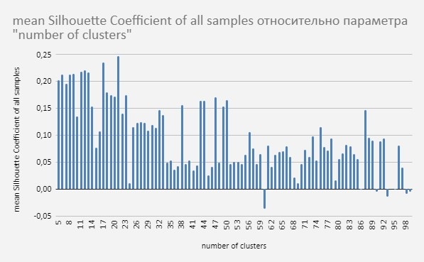

# Проект рекомендательной системы для аптечной сети

- [Описание сервиса](#описание-сервиса)
- [Построение модели коллаборативной фильтрации](#построение-модели-коллаборативной-фильтрации)
- [Построение модели Word2Vec](#построение-модели-word2vec)
- [Построение модели кластеризации](#построение-модели-кластеризации)
    - [Подбор количества классов](#подбор-количества-классов)
- [Выдача рекомендаций](#выдача-рекомендаций)

## Описание сервиса

Сервис получает данные о покупках клиента, анализирует их с помощью модели машинного обучения и отправляет сотруднику на кассе перечень рекомендуемых товаров. В него входят топ-3 товаров, которые клиент с высокой вероятностью добавит к своим покупкам. Сервис предлагает конкретные товарные позиции с точностью до артикула (SKU).

В сервисе предусмотрено два вида рекомендаций:
1. На основе выявления похожих покупателей со схожими предпочтениями 
2. Рекомендации товаров, которые часто покупают совместно

Автоматизированный ML-инструмент помогает выявлять скрытые потребности клиентов и предоставлять им полезные и точные рекомендации по индивидуальному списку приобретенных медикаментов. Задача данного решения - увеличение среднего чека за счёт адресных, нужных покупателю, предложений.

## Исследовательский анализ данных

Данные о продажах хранятся в CSV файлах:
- чековые данные.csv - данные о продажах
- products.csv - справочник товаров

### Общий обзор данных о продажах

```python
import pandas as pd
import numpy as np
from datetime import datetime

# Загрузка данных
data = pd.read_csv('data/чековые данные.csv')
data.head()
```

```
         sale_date  contact_id  shop_id  product_id  sub_category_id  category_id  brand_id  quantity
0    2018-12-07    1260627     1455     168308      906             205          -1        1.0
1    2018-12-07    198287      279      134832      404             93           -1        1.0
2    2018-12-07    2418385     848      101384      404             93           -1        1.0
```

### Число уникальных значений в каждой колонке

```python
unique_counts = data.nunique()
pd.DataFrame({'Колонка': unique_counts.index, 'Уникальных значений': unique_counts.values})
```

```
           Колонка                Уникальных значений
0          sale_date             214
1          contact_id            1642379
2          shop_id               851
3          product_id            36549
4          sub_category_id       440
5          category_id           145
6          brand_id              1617
7          quantity              1296
```

## Построение модели коллаборативной фильтрации

### Подготовка данных

#### Загружаем данные и отбираем необходимые колонки, создаем дополнительный столбец с номером недели в году для последующего разбиения

```python
# Загрузка данных
data = pd.read_csv('data/чековые данные.csv', parse_dates=['sale_date'])

# Подготовка данных
data = data[['sale_date', 'contact_id', 'product_id', 'quantity']]
data['quantity'] = data['quantity'].apply(lambda x: 1 if x != 1 else x)
data = data.rename(columns={
    'product_id': 'item_id',
    'contact_id': 'user_id'
})
data['week_of_year'] = data['sale_date'].dt.isocalendar().week

data.head()
```

```
         sale_date  user_id    item_id  quantity  week_of_year
0    2018-12-07    1260627    168308   1.0       49
1    2018-12-07    198287     134832   1.0       49
2    2018-12-07    2418385    101384   1.0       49
3    2018-12-07    1285774    168570   1.0       49
4    2018-12-07    1810323    168319   1.0       49
```

#### Отберем только 15 последних недель для обучения

```python
def sample_by_week(df, week_col_name, split_size_weeks):
    threshold_week = df[week_col_name].max() - split_size_weeks
    df_before = df[df[week_col_name] < threshold_week]
    df_after = df[df[week_col_name] >= threshold_week]
    return df_before, df_after

_, data = sample_by_week(df=data, week_col_name='week_of_year', split_size_weeks=15)
data.sort_values('sale_date').head(3)
```

```
         sale_date  user_id  item_id  quantity  week_of_year
0    2018-11-08    2591126  32087    1.0       45
1    2018-11-08    2542992  97117    1.0       45
2    2018-11-08    2477043  106860   1.0       45
```

#### Просмотрим статистические данные по выборке

```python
def basic_statistics_of_data(df):
    numerator = len(df)
    num_users = df['user_id'].nunique()
    num_items = df['item_id'].nunique() 
    denominator = num_users * num_items
    sparsity = (1.0 - (numerator * 1.0) / denominator) * 100
    
    stats = {
        'total number of rows': '{:,}'.format(numerator).replace(',', '\''),
        'number of users': '{:,}'.format(num_users).replace(',', '\''),
        'number of items': '{:,}'.format(num_items).replace(',', '\''),
        'sparsity': f"{sparsity:.2f}% empty"
    }
    return pd.DataFrame(list(stats.items()), columns=['statistic', 'value'])

basic_statistics_of_data(data)
```

```
             statistic           value
0     total number of rows   4'603'016
1     number of users        854'281
2     number of items        22'921
3     sparsity              99.97% empty
```

#### Сделаем случайное разбиение на тестовую и обучающую выборки. Для теста возьмем 10%

```python
from sklearn.model_selection import train_test_split

train, test = train_test_split(data, test_size=0.1, random_state=3)
```

### Обучение модели

```python
from surprise import Reader, Dataset, SVD
import joblib

# Подготовка данных для Surprise
reader = Reader(rating_scale=(0, 1))
train_data = Dataset.load_from_df(train[['user_id', 'item_id', 'quantity']], reader)
trainset = train_data.build_full_trainset()

# Обучение модели
model_als = SVD(n_factors=10, n_epochs=10, lr_all=0.1, reg_all=0.1)
model_als.fit(trainset)

# Сохранение модели
joblib.dump(model_als, 'models/als_model_2024_12_20.joblib')
```

#### Параметры модели ALS

```python
model_params = pd.DataFrame([
    ('Rank', '10'),
    ('MaxIter', '10'),
    ('RegParam', '0.1')
], columns=['parameter', 'value'])
model_params
```

```
   parameter   value
0  Rank        10
1  MaxIter     10
2  RegParam    0.1
```

### Метрики качества

#### Создадим результирующую таблицу с реальными и предсказанными товарами для оценки качества

```python
# Получение предсказаний
def get_top_n_items(predictions, n=5):
    top_n = {}
    for uid, iid, _, est, _ in predictions:
        if uid not in top_n:
            top_n[uid] = []
        top_n[uid].append((iid, est))
    
    # Сортировка и отбор top-n для каждого пользователя    
    for uid, user_ratings in top_n.items():
        user_ratings.sort(key=lambda x: x[1], reverse=True)
        top_n[uid] = [iid for iid, _ in user_ratings[:n]]
    
    return top_n

# Получаем фактические товары
train_actual_items = train.groupby('user_id')['item_id'].agg(list).reset_index()
train_actual_items = train_actual_items.rename(columns={'item_id': 'actual'})

# Получаем предсказанные товары
testset = trainset.build_anti_testset()
predictions = model_als.test(testset)
top_n = get_top_n_items(predictions, n=5)

# Создаем DataFrame с предсказаниями
train_recs_items = pd.DataFrame([(uid, recs) for uid, recs in top_n.items()],
                               columns=['user_id', 'recs_ALS'])

# Объединяем результаты
result = pd.merge(train_actual_items, train_recs_items, on='user_id', how='inner')
result.head()
```

```
   user_id                actual                             recs_ALS
0     463     [102659, 66900]    [61115, 138005, 162780, 135427, 46797]
1     471     [51466, 28784]     [162780, 135427, 46797, 138956, 61115]
2    1238     [59334, 102788]    [41096, 102788, 46797, 110629, 156491]
3    1342     [97772, 110565]    [110629, 156491, 61115, 138005, 162780]
4    1580     [60809, 153583]    [138005, 61115, 162780, 156491, 110629]
```

#### Выведем метрики оценки качества модели

```python
from sklearn.metrics import mean_squared_error
import numpy as np

def calculate_metrics(predictions, result_df):
    # RMSE
    y_true = [pred.r_ui for pred in predictions]
    y_pred = [pred.est for pred in predictions]
    rmse = np.sqrt(mean_squared_error(y_true, y_pred))
    
    # Precision@k и NDCG@k
    def precision_at_k(actual, predicted, k=5):
        if len(predicted) > k:
            predicted = predicted[:k]
        return len(set(actual) & set(predicted)) / k
    
    def ndcg_at_k(actual, predicted, k=5):
        if len(predicted) > k:
            predicted = predicted[:k]
        
        dcg = sum(1 / np.log2(i + 2) for i, item in enumerate(predicted) if item in actual)
        idcg = sum(1 / np.log2(i + 2) for i in range(min(len(actual), k)))
        
        return dcg / idcg if idcg > 0 else 0
    
    precision = np.mean([precision_at_k(row['actual'], row['recs_ALS'])
                        for _, row in result_df.iterrows()])
    
    ndcg = np.mean([ndcg_at_k(row['actual'], row['recs_ALS'])
                    for _, row in result_df.iterrows()])
    
    return pd.DataFrame([
        ('RMSE', round(rmse, 5)),
        ('precision@k', round(precision, 5)),
        ('ndcg@k', round(ndcg, 5))
    ], columns=['metric', 'value'])

metrics_df = calculate_metrics(predictions, result)
metrics_df
```

```
           metric    value
0          RMSE     0.98132
1     precision@k   0.06178
2        ndcg@k     0.06803
```

## Построение модели Word2Vec

### Подготовка данных

#### Загружаем и подготавливаем данные

```python
import pandas as pd
from gensim.models import Word2Vec

# Загрузка данных
data = pd.read_csv('data/чековые данные.csv', parse_dates=['sale_date'])
data = data[['sale_date', 'contact_id', 'shop_id', 'product_id', 'quantity']]
data['product_id'] = data['product_id'].astype(str)

# Загрузка справочника продуктов
products = pd.read_csv('data/products.csv')
products['name'] = products['name'].str.replace(r'(\(\d+\) )', '', regex=True)

products.head()
```

```
   product_id                                               name
0      104124  Раствор Ликосол-2000 для конт.линз фл 240мл 817
1       92248  Риностоп спрей наз. 0,05% фл. 15мл 701
2      350363  Кларитросин табл.п.п.о. 500мг №10 403
3      129004  Флуконазол-Тева капс. 150мг №1 622
4      125915  Валсартан-Гидрохлоротиазид таб. п.п.о. 80мг+12,5мг №28 738
```

##### Просмотрим количество уникальных пользователей в нашем наборе данных

```python
users = data['contact_id'].unique()
print('Number of unique users = ' + str('{0:,}'.format(len(users)).replace(',', '\'')))
```

```shell
Number of unique users = 1'636'831
```

#### Сделаем разбиение на тестовую и обучающую выборки. Разбиение будем делать по клиентам

```python
from sklearn.model_selection import train_test_split

# Разбиение пользователей на train/test
users_train, users_valid = train_test_split(users, test_size=0.1, random_state=5)

# Формирование выборок на основе принадлежности клиента
train_df = data[data['contact_id'].isin(users_train)]
validation_df = data[data['contact_id'].isin(users_valid)]

print(f'train_df.shape = {train_df.shape}\nvalidation_df.shape = {validation_df.shape}')
```

```shell
train_df.shape = (17398192, 5)
validation_df.shape = (1948492, 5)
```

#### Подготовим данные с группировкой по чекам

```python
def create_orders(df):
    return df.groupby(['sale_date', 'shop_id', 'contact_id'])['product_id'].agg(list).reset_index()\
             .rename(columns={'product_id': 'actual_products'})

train_orders = create_orders(train_df)
validation_orders = create_orders(validation_df)

train_orders.head()
```

```shell
            sale_date  shop_id  contact_id     actual_products
0    2018-01-01      100      10001        [77808, 130823]
1    2018-01-01      100      10002        [60367, 125733]
2    2018-01-01      101      10003        [110629, 138956]
3    2018-01-01      101      10004        [217227, 136540, 126540]
4    2018-01-01      102      10005        [70951, 94613, 23331]
```

### Обучение модели

```python
# Подготовка данных для Word2Vec
sentences = train_orders['actual_products'].values.tolist()

# Обучение модели
word2vec = Word2Vec(sentences=sentences, vector_size=100, window=3, min_count=5, workers=4, seed=33)

# Сохранение модели
word2vec.save('models/word2vec_model_2024_12_20.model')

# Проверка сохранения
loaded_model = Word2Vec.load('models/word2vec_model_2024_12_20.model')
print('Модель успешно сохранена и загружена')
```

### Метрики

К сожалению для данной модели без онлайн потока данных о реальных продажах оценить качество не представляется возможным.


## Построение модели кластеризации

#### Загружаем данные и модель Word2Vec

```python
import pandas as pd
import numpy as np
from gensim.models import Word2Vec
from sklearn.cluster import KMeans
import matplotlib.pyplot as plt

# Загрузка Word2Vec модели
w2v_model = Word2Vec.load('models/word2vec_model_2024_12_20.model')

# Получение векторов продуктов
product_vectors = pd.DataFrame(
    [(word, w2v_model.wv[word]) for word in w2v_model.wv.index_to_key],
    columns=['product_id', 'vector']
)

# Загрузка справочника продуктов
products = pd.read_csv('data/products.csv')
products['name'] = products['name'].str.replace(r'(\(\d+\) )', '', regex=True)

product_vectors.head()
```

```
   product_id                                              vector
0      144322   [-0.0024441950954, 0.0023234324523, ...]
1       58451   [-3.9240214391611, 0.1234567890123, ...]
2       75120   [-0.0589764676988, -0.0234567890123, ...]
3      153532   [-0.0256759468466, 0.0345678901234, ...]
4      134530   [-0.0764870494604, -0.0456789012345, ...]
```

```python
products.head()
```

```
   product_id                                               name
0      104124  Раствор Ликосол-2000 для конт.линз фл 240мл 817
1       92248  Риностоп спрей наз. 0,05% фл. 15мл 701
2      350363  Кларитросин табл.п.п.о. 500мг №10 403
3      129004  Флуконазол-Тева капс. 150мг №1 622
4      125915  Валсартан-Гидрохлоротиазид таб. п.п.о. 80мг+12,5мг №28 738
```

### Подбор количества классов

Подбор осуществляется по максимальному значению коэффициента `silhouette`.

Коэффициент «силуэт» вычисляется с помощью среднего внутрикластерного расстояния (a) и среднего расстояния до ближайшего кластера (b) по каждому образцу. Силуэт вычисляется как (b - a) / max(a, b). Поясню: b — это расстояние между a и ближайшим кластером, в который a не входит. Можно вычислить среднее значение силуэта по всем образцам и использовать его как метрику для оценки количества кластеров.

```python
from sklearn.metrics import silhouette_score
from tqdm import tqdm

def get_silhouette_scores(vectors_df, clusters_range):
    # Преобразуем векторы в numpy массив
    X = np.stack(vectors_df['vector'].values)
    
    scores = []
    for n_clusters in tqdm(clusters_range):
        kmeans = KMeans(n_clusters=n_clusters, n_init=1, max_iter=20, random_state=3)
        cluster_labels = kmeans.fit_predict(X)
        silhouette_avg = silhouette_score(X, cluster_labels)
        scores.append((n_clusters, silhouette_avg))
        print(f'n_clusters: {n_clusters}, score: {silhouette_avg}')
    
    return pd.DataFrame(scores, columns=['n_clusters', 'score'])

# Подбираем количество кластеров
clusters_range = range(5, 100, 1)
scores_df = get_silhouette_scores(product_vectors, clusters_range)

# Выводим лучшие результаты
scores_df.sort_values('score', ascending=False).head()
```

```
   n_clusters              score
0         21     0.24705539575632268
1         17     0.23530894861309629
2         12     0.22083229042257424
3         11     0.21774700055303492
4         13     0.21705090230733062
```

Визуализация результатов:



### Обучение конечной модели

По значению метрики наилучшее разбиение получается на 21 класс

```python
# Подготовка данных
X = np.stack(product_vectors['vector'].values)

# Инициализация и обучение модели
best_k = 21
kmeans = KMeans(n_clusters=best_k, random_state=3, n_init=1)
kmeans_model = kmeans.fit(X)

# Сохранение модели
import joblib
joblib.dump(kmeans, 'models/kmeans_2024_12_20.joblib')
joblib.dump(kmeans_model, 'models/kmeans_model_2024_12_20.joblib')
```

### Просмотр результатов кластеризации

```python
def show_products_of_one_cluster(products_df, predictions, num_cluster, n_rows=10, sort=True):
    cluster_products = predictions[predictions['cluster'] == num_cluster]
    result = pd.merge(cluster_products[['product_id']], products_df, on='product_id', how='left')
    if sort:
        result = result.sort_values('name')
    return result.head(n_rows)

# Добавляем предсказанные кластеры
predictions = product_vectors.copy()
predictions['cluster'] = kmeans_model.predict(X)

# Просмотр содержания кластера №10
print('\nПродукты кластера №10:')
show_products_of_one_cluster(products, predictions, num_cluster=10, n_rows=10)
```

```
Продукты кластера №10:
   product_id                                               name
0      115298  Аир [корневища 1,5г фильтр-пакет уп] N20 КЛС 617
1      112056  Аир [корневища пачка 75г] N1 КЛС 617
2      142245  Алтей [корень коробка 75г] N1 КЛС 617
3      107187  Анис [плоды] 50г N1 617
4       55079  Багульник [болотного побеги пачка 50г] N1 КЛС 617
5       35217  Береза [лист пачка 50г] N1 617
6       64809  Береза [лист фильтр-пакет 1,5г] N20 КЛС 617
```

## Выдача рекомендаций

### Создаем классы для разных видов рекомендаций

```python
class ModelALS:
    def __init__(self):
        self.model = None
        
    def load_model(self, model_path):
        """Загрузка модели"""
        import joblib
        self.model = joblib.load(model_path)
    
    def predict_to_dict(self, user_id, n_recs=5):
        """Выдача предсказаний в виде словаря"""
        import time
        start = time.time()
        
        # Получаем предсказания для пользователя
        testset = [(user_id, iid, 0) for iid in self.model.trainset.all_items()]
        predictions = self.model.test(testset)
        
        # Сортируем и отбираем top-n рекомендаций
        top_n = sorted(predictions, key=lambda x: x.est, reverse=True)[:n_recs]
        
        return {
            'user_id': user_id,
            'recommendations': [int(pred.iid) for pred in top_n],
            'prediction time': round(time.time() - start, 3)
        }


class ModelWord2Vec:
    def __init__(self):
        self.model = None
        
    def load_model(self, model_path):
        """Загрузка модели"""
        from gensim.models import Word2Vec
        self.model = Word2Vec.load(model_path)
    
    def predict_to_dict(self, product_id, n_recs=5):
        """Выдача предсказаний в виде словаря"""
        import time
        start = time.time()
        
        # Получаем похожие товары
        similar_products = self.model.wv.most_similar(str(product_id), topn=n_recs)
        
        return {
            'product_id': product_id,
            'recommendations': [int(prod_id) for prod_id, _ in similar_products],
            'prediction time': round(time.time() - start, 3)
        }
    
    def get_name_product_id(self, products_df, product_id):
        """Получение названия продукта по ID"""
        return products_df[products_df['product_id'] == product_id]['name'].iloc[0]
    
    def predict_to_df(self, products_df, product_id, num_recs=5):
        """Выдача предсказаний в виде DataFrame с названиями товаров"""
        similar_products = self.model.wv.most_similar(str(product_id), topn=num_recs)
        
        recs_df = pd.DataFrame(similar_products, columns=['product_id', 'similarity'])
        recs_df['product_id'] = recs_df['product_id'].astype(int)
        
        return recs_df.merge(products_df, on='product_id', how='inner')\
                     .sort_values('similarity', ascending=False)\
                     .assign(similarity=lambda x: round(x['similarity'], 6))[['product_id', 'name']]
```

### Выполняем рекомендации

#### Загружаем модели

```python
# Инициализация и загрузка моделей
model_als = ModelALS()
model_als.load_model('models/als_model_2024_12_20.joblib')

model_w2v = ModelWord2Vec()
model_w2v.load_model('models/word2vec_model_2024_12_20.model')

# Загружаем справочник продуктов
products = pd.read_csv('data/products.csv')
```

#### Делаем предсказание 3 товаров для покупателя `contact_id=471`

```python
predict_als = model_als.predict_to_dict(user_id=471, n_recs=3)
from pprint import pprint
pprint(predict_als)
```

```
{'user_id': 471, 
 'prediction time': 154.332, 
 'recommendations': [162780, 135427, 46797]}
```

#### Делаем предсказание для товара `product_id=33569`

```python
product_name = model_w2v.get_name_product_id(products, product_id=33569)
print(product_name)
```

```
Диротон таб.20мг №28 738
```

```python
predict_w2v = model_w2v.predict_to_dict(product_id=33569, n_recs=3)
pprint(predict_w2v)
```

```
{'prediction time': 0.198,
 'product_id': 33569,
 'recommendations': [52119, 60972, 137421]}
```

```python
predict_w2v_df = model_w2v.predict_to_df(products, product_id=33569, num_recs=3)
predict_w2v_df
```

```
   product_id                                               name
0       52119  Метопролол ретард-Акрихин таб.пролонг.п.п.о.100мг №30 738
1       60972  Амлодипин тб 10мг N20 738
2      137421  Пектрол табл. 40 мг. №30 738
```

### Использование кластеризации

```python
# Загрузка моделей кластеризации
import joblib
kmeans_model = joblib.load('models/kmeans_model_2024_12_20.joblib')

# Получение векторов продуктов из Word2Vec модели
product_vectors = pd.DataFrame(
    [(word, model_w2v.model.wv[word]) for word in model_w2v.model.wv.index_to_key],
    columns=['product_id', 'vector']
)

# Получение предсказаний кластеров
X = np.stack(product_vectors['vector'].values)
predictions = product_vectors.copy()
predictions['cluster'] = kmeans_model.predict(X)

# Просмотр содержания кластера №10
print('\nПродукты кластера №10:')
def show_cluster_products(cluster_num, n_rows=10):
    cluster_products = predictions[predictions['cluster'] == cluster_num]
    result = pd.merge(cluster_products[['product_id']], products, on='product_id', how='left')
    return result.sort_values('name').head(n_rows)

show_cluster_products(10)
```

```
   product_id                                               name
0      115298  Аир [корневища 1,5г фильтр-пакет уп] N20 КЛС 617
1      112056  Аир [корневища пачка 75г] N1 КЛС 617
2      142245  Алтей [корень коробка 75г] N1 КЛС 617
3      107187  Анис [плоды] 50г N1 617
4       55079  Багульник [болотного побеги пачка 50г] N1 КЛС 617
5       35217  Береза [лист пачка 50г] N1 617
6       64809  Береза [лист фильтр-пакет 1,5г] N20 КЛС 617
```